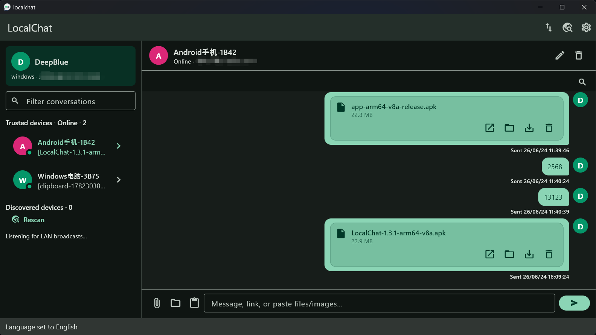

  

<h1 align="center">LocalChat</h1>

<b>LocalChat</b> — 局域网直连、聊天式文件与文本互传工具

  <b>简体中文</b> · <a href="#english">English</a>

  

  

  <video src="docs/Picture/drag_demo.mp4" width="860" controls muted autoplay loop></video>

  一个基于 Flutter 构建的局域网直连传输工具，用聊天窗口的方式在 Windows 和 Android 设备之间极速、安全、私密地发送文字、链接、图片、文件及文件夹。
   
  不经过公网中转，不依赖第三方账号，支持拖拽投递、设置自动隐藏呼吸条等便捷交互。

---

## 简体中文 🚀

### 📌 项目定位

LocalChat 不是云盘，也不是公网 IM。它专注于高频的本地场景：当您的电脑和手机处在同一局域网时，提供极速、安全且可追溯的直连传输体验。

### 🌟 功能亮点

- **⚡ 局域网直连**: 自动通过 UDP 广播发现设备，使用高性能本地 HTTP 服务直连传输，速度仅受限于网络带宽。
- **💬 聊天式体验**: 将文字、链接、图片、文件和文件夹统一落入聊天会话时间线，传输记录、状态与保存路径一目了然。
- **💻 桌面端快捷拖拽 (Quick Drop Shelf)**: 拖拽文件到悬浮窗口图标即可唤出设备卡片投递发送。支持“贴边自动隐藏”呼吸条和右键快捷隐藏。
- **🔒 身份安全防护**: 采用 Ed25519 签名验证、X25519 密钥协商，并使用 AES-GCM 对文字和文件块进行端到端加密。
- **🎨 统一核心逻辑**: 共享 Windows 和 Android 的业务底座，具备网络诊断、自定义存储路径等丰富功能。

<b>🛠️ 查看已实现功能详情 (点击展开)</b>

- **💬 聊天内嵌配对卡片**：在聊天区域完成可信配对确认，支持 65 秒超时及多请求并发。
- **⚙️ 桌面快捷悬浮托盘**：贴边停靠、延时折叠、右键菜单，长设备名折行显示（DT_WORDBREAK）。
- **🔧 网络诊断工具**：在手动添加设备时提供连接测试，引导排查校园网等复杂网络环境。
- **📢 系统通知与保活**：集成系统原生通知（包含预览开关），在后台智能保活。
- **📁 文件夹递归传输**：支持文件夹在传输时保留层级目录结构。
- **🌐 跨网段手动直连**：支持通过手动输入 IP 和端口添加非同网段的直连设备。
- **🔔 Windows 托盘与开机自启**：支持开机自动运行、单实例检测唤醒。
- **📊 独立传输中心**：集中管理所有进行中、完成、失败或已取消的任务队列。
- **📷 图片编辑与标注**：发送图片前支持裁剪、旋转、画笔和文字标注，纯本地处理。
- **💾 归档与重命名**：支持按会话、年月、类型分类归档，允许在传输历史中对文件直接重命名。
- **🎨 主题随心切换**：支持浅色、深色、跟随系统三种主题模式。

<b>📦 安装与开发说明 (点击展开)</b>

#### 环境依赖
1. 按照 Flutter 官方文档安装 SDK: <https://docs.flutter.dev/get-started/install>
2. 构建 Android: 安装 Android toolchain
3. 构建 Windows: 启用 Windows 桌面开发支持

#### 常用开发命令
- **获取依赖**: `flutter pub get`
- **代码分析与测试**: `flutter analyze` / `flutter test`
- **构建 Android Release**: `flutter build apk --release --split-per-abi`
- **构建 Windows Release**: `flutter build windows --release`

### 💡 基本使用流程

1. 两端同时打开 LocalChat 客户端。
2. 在设备列表内找到目标，或手动输入 IP 与端口连接。
3. 确认 6 位配对校验码以建立可信关系。
4. 在会话中发文字、图片、拖拽文件或粘贴剪贴板即可完成投递！

---

<h2 id="english">English 💻</h2>

### 📌 Overview

LocalChat is not a cloud drive or a public messenger. It is built for a common offline LAN environment, helping you move content directly between your phone and computer without third-party servers.

### 🌟 Highlights

- **⚡ Direct Transfer**: Discover peers via UDP broadcast and transfer files over local HTTP at maximum network speeds.
- **💬 Timeline UI**: Message history, links, images, and files reside in a single conversation thread, keeping tracking clear.
- **💻 Desktop Drag-Send (Quick Drop Shelf)**: Drag files to the screen-edge float window to quick-send. Supports docking auto-hide and right-click context menu.
- **🔒 Secure Pairing**: Uses Ed25519 signatures, X25519 key exchange, and AES-GCM encryption for messages and file streams.
- **🎨 Cross-Platform Core**: Sharing core code between Windows & Android with features like custom storage and network diagnostics.

<b>🛠️ Full Features & Implementation Details (Click to expand)</b>

- **💬 Inline Chat Pairing Cards**: Peer confirmation via 6-digit verification code directly in conversation timeline.
- **⚙️ Native Drop Shelf**: Smooth animation, auto-docking, right-click actions, and word wrap for long device names.
- **🔧 Diagnostic Tool**: Connectivity testing and tips for complex setups like university networks.
- **📢 Native Notifications**: Standard notifications with custom preview toggle and smart keep-alive.
- **📁 Folder Struct Transfer**: Preserves directory trees when recursively sending folders.
- **🌐 Cross-Subnet Direct**: Add peers manually using IP address and port.
- **🔔 Windows Integration**: Minimizes to system tray, runs at startup, and enforces single-instance launch.
- **📊 Transfer Queue Center**: Dedicated page for pausing, canceling, and resuming large batch file queues.
- **📷 Local Image Editor**: Crop, rotate, draw, and annotate images locally before hitting send.
- **💾 Auto Archive**: Sorts received files by month/type and allows file renaming directly in-app.

<b>📦 Setup & Development Guide (Click to expand)</b>

#### Prerequisites
1. Setup Flutter SDK: <https://docs.flutter.dev/get-started/install>
2. Build Android: Install Android SDK toolchain
3. Build Windows: Enable desktop support

#### CLI Reference
- **Install dependencies**: `flutter pub get`
- **Lint & test**: `flutter analyze` / `flutter test`
- **Build Android**: `flutter build apk --release --split-per-abi`
- **Build Windows**: `flutter build windows --release`

### 💡 Workflow

1. Open LocalChat on both devices.
2. Select peer or enter manual IP and Port.
3. Validate 6-digit code to pair.
4. Drag & drop files or type text to send!

---

## 📝 Roadmap

- **⚙️ Robust Resumable Transfer**: Implementing granular chunk recovery.
- **🔋 Deep Background Optimization**: Enhancing mobile sleep survival rates and connectivity transitions.
- **📱 Multitude Platforms**: Paving ways to more OS integrations and user-defined device access control.
