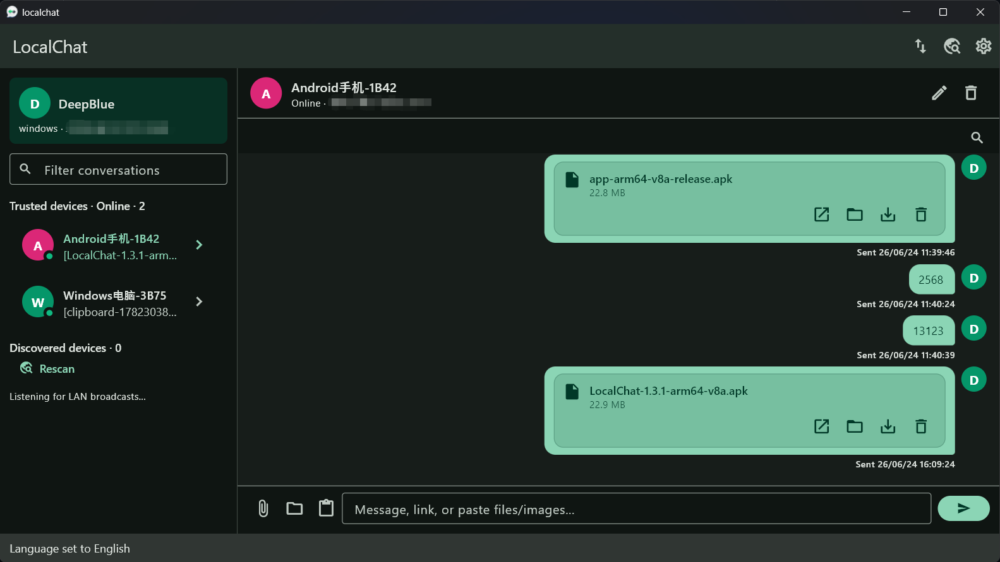
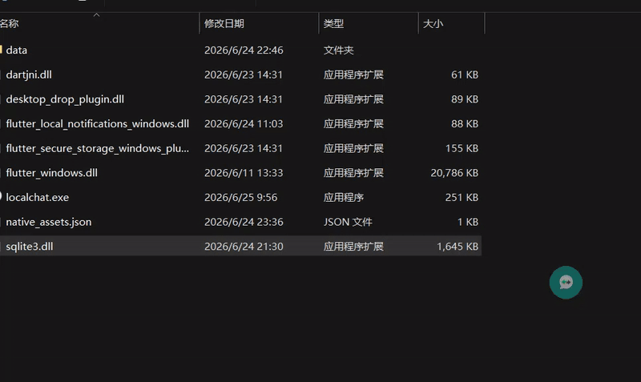

<p align="center">
  
</p>

<h1 align="center">LocalChat</h1>

<p align="center"><sub><b>LocalChat</b> — 局域网直连、聊天式文件与文本互传工具</sub></p>

<p align="center">
  <b>简体中文</b> · <a href="#english">English</a>
</p>

<p align="center">
  <a href="https://github.com/Mintcolour/LocalChat/releases">
    
  </a>
</p>

<p align="center">
  
</p>

<p align="center">
  <b>🎥 拖拽功能演示（旧版悬浮窗交互 / Previous floating-window interaction）</b>
</p>
<p align="center">
  <a href="docs/Picture/drag_demo.mp4">
    
  </a>
</p>

<p align="center">
  一个基于 Flutter 构建的局域网直连传输工具，用聊天窗口的方式在 Windows 和 Android 设备之间极速、安全、私密地发送文字、链接、图片、文件及文件夹。
  <br/>
  不经过公网中转，不依赖第三方账号，拖动文件时可通过右下角自动出现的投递条快捷发送。
</p>

---

## 简体中文 🚀

### 📌 项目定位

LocalChat 不是云盘，也不是公网 IM。它专注于高频的本地场景：当您的电脑和手机处在同一局域网时，提供极速、安全且可追溯的直连传输体验。

### 🌟 功能亮点

- **⚡ 局域网直连**: 自动通过 UDP 广播发现设备，使用高性能本地 HTTP 服务直连传输，速度仅受限于网络带宽。
- **💬 聊天式体验**: 将文字、链接、图片、文件和文件夹统一落入聊天会话时间线，传输记录、状态与保存路径一目了然。
- **💻 桌面端快捷拖拽 (Quick Drop Shelf)**: 从 Windows 桌面或资源管理器拖动文件时，右下角自动出现投递条；拖入后展开在线可信设备，松手即可发送。平时及取消拖动后自动隐藏。
- **🔒 身份安全防护**: 采用 Ed25519 签名验证、X25519 密钥协商，并使用 AES-GCM 对文字和文件块进行端到端加密。
- **🎨 统一核心逻辑**: 共享 Windows 和 Android 的业务底座，具备网络诊断、自定义存储路径等丰富功能。

<details>
<summary><b>🛠️ 查看已实现功能详情 (点击展开)</b></summary>

- **💬 聊天内嵌配对卡片**：在聊天区域完成可信配对确认，支持 65 秒超时及多请求并发。
- **⚙️ 按需显示的快捷投递条**：在设置中开启“桌面快捷拖拽发送”，拖动文件时显示入口，移入后展开设备卡片，长设备名自动折行。
- **🔧 网络诊断工具**：在手动添加设备时提供连接测试，引导排查校园网等复杂网络环境。
- **📢 系统通知与保活**：集成系统原生通知（包含预览开关），在后台智能保活。
- **📁 文件夹递归传输**：支持文件夹在传输时保留层级目录结构。
- **🌐 跨网段手动直连**：支持通过手动输入 IP 和端口添加非同网段的直连设备。
- **🔔 Windows 托盘与开机自启**：支持开机自动运行、单实例检测唤醒。
- **📊 独立传输中心**：集中管理所有进行中、完成、失败或已取消的任务队列。
- **📷 图片编辑与标注**：发送图片前支持裁剪、旋转、画笔和文字标注，纯本地处理。
- **💾 归档与重命名**：支持按会话、年月、类型分类归档，允许在传输历史中对文件直接重命名。
- **🎨 主题随心切换**：支持浅色、深色、跟随系统三种主题模式。

</details>

<details>
<summary><b>📦 安装与开发说明 (点击展开)</b></summary>

#### 环境依赖
1. 按照 Flutter 官方文档安装 SDK: <https://docs.flutter.dev/get-started/install>
2. 构建 Android: 安装 Android toolchain
3. 构建 Windows: 启用 Windows 桌面开发支持

#### 常用开发命令
- **获取依赖**: `flutter pub get`
- **代码分析与测试**: `flutter analyze` / `flutter test`
- **构建 Android Release**: `flutter build apk --release --split-per-abi`
- **构建 Windows Release**: `flutter build windows --release`

</details>

### 💡 基本使用流程

1. 两端同时打开 LocalChat 客户端。
2. 在设备列表内找到目标，或手动输入 IP 与端口连接。
3. 确认 6 位配对校验码以建立可信关系。
4. 在会话中发文字、图片、拖拽文件或粘贴剪贴板即可完成投递！
5. Windows 可在设置中开启“桌面快捷拖拽发送”，将桌面或资源管理器中的文件拖向右下角投递条，再投递到目标设备卡片。发送或取消拖动后，投递条会自动隐藏。

---

<h2 id="english">English 💻</h2>

### 📌 Overview

LocalChat is not a cloud drive or a public messenger. It is built for a common offline LAN environment, helping you move content directly between your phone and computer without third-party servers.

### 🌟 Highlights

- **⚡ Direct Transfer**: Discover peers via UDP broadcast and transfer files over local HTTP at maximum network speeds.
- **💬 Timeline UI**: Message history, links, images, and files reside in a single conversation thread, keeping tracking clear.
- **💻 Desktop Drag-Send (Quick Drop Shelf)**: Drag files from the Windows desktop or File Explorer to reveal a drop bar at the bottom right. Move onto it to expand online trusted devices, then drop on a device to send. It stays hidden between drags and disappears when a drag ends or is canceled.
- **🔒 Secure Pairing**: Uses Ed25519 signatures, X25519 key exchange, and AES-GCM encryption for messages and file streams.
- **🎨 Cross-Platform Core**: Sharing core code between Windows & Android with features like custom storage and network diagnostics.

<details>
<summary><b>🛠️ Full Features & Implementation Details (Click to expand)</b></summary>

- **💬 Inline Chat Pairing Cards**: Peer confirmation via 6-digit verification code directly in conversation timeline.
- **⚙️ Native Drop Shelf**: Enable desktop quick drag-send in Settings to show the drop bar only during file drags, with expandable device cards and word wrap for long device names.
- **🔧 Diagnostic Tool**: Connectivity testing and tips for complex setups like university networks.
- **📢 Native Notifications**: Standard notifications with custom preview toggle and smart keep-alive.
- **📁 Folder Struct Transfer**: Preserves directory trees when recursively sending folders.
- **🌐 Cross-Subnet Direct**: Add peers manually using IP address and port.
- **🔔 Windows Integration**: Minimizes to system tray, runs at startup, and enforces single-instance launch.
- **📊 Transfer Queue Center**: Dedicated page for pausing, canceling, and resuming large batch file queues.
- **📷 Local Image Editor**: Crop, rotate, draw, and annotate images locally before hitting send.
- **💾 Auto Archive**: Sorts received files by month/type and allows file renaming directly in-app.

</details>

<details>
<summary><b>📦 Setup & Development Guide (Click to expand)</b></summary>

#### Prerequisites
1. Setup Flutter SDK: <https://docs.flutter.dev/get-started/install>
2. Build Android: Install Android SDK toolchain
3. Build Windows: Enable desktop support

#### CLI Reference
- **Install dependencies**: `flutter pub get`
- **Lint & test**: `flutter analyze` / `flutter test`
- **Build Android**: `flutter build apk --release --split-per-abi`
- **Build Windows**: `flutter build windows --release`

</details>

### 💡 Workflow

1. Open LocalChat on both devices.
2. Select peer or enter manual IP and Port.
3. Validate 6-digit code to pair.
4. Drag & drop files or type text to send!
5. On Windows, enable “Desktop quick drag-send” in Settings. Drag files from the desktop or File Explorer to the bottom-right drop bar, then drop onto a device card. The bar hides after sending or canceling the drag.

---

## 🤖 AI Agent / 命令行调用

Windows 发布包内包含 `localchat-cli.exe`，与 `localchat.exe` 放在同一目录。
能执行本机终端命令的 AI Agent 和脚本可以调用它，将结果发送给已配对的 Windows 或 Android 设备。
两端需要可以局域网直连；首次配对在 LocalChat 界面完成。

```powershell
# 在发布包目录执行；也可以使用 EXE 的绝对路径
.\localchat-cli.exe devices --json
.\localchat-cli.exe send --to '我的手机' --text '任务已完成' --json
.\localchat-cli.exe send --to '<设备ID>' --file 'D:\输出\报告.pdf' --json
.\localchat-cli.exe send --to '<设备ID>' --folder 'D:\输出' --json

# 多个文件（图片也是文件）；逗号作为文件名的一部分保留
.\localchat-cli.exe send --to '<设备ID>' --file 'D:\输出\报告.pdf' --file 'D:\输出\图.png' --json

# 从 UTF-8 文件发送长文本，保留换行
.\localchat-cli.exe send --to '<设备ID>' --text-file 'D:\输出\总结.txt' --json
# --stdin 读取 UTF-8 标准输入。PowerShell 7 示例：
Get-Content -Raw -Encoding utf8 'D:\输出\总结.txt' | .\localchat-cli.exe send --to '<设备ID>' --stdin --json

# 大文件可快速入队，再按返回的 jobId 查询
.\localchat-cli.exe send --to '<设备ID>' --file 'D:\大文件.zip' --no-wait --json
.\localchat-cli.exe status --job '<任务ID>' --json
```

### 调用约定

- 必须传 `--to`，支持界面中的完整会话名称、设备原名或稳定设备 ID；同名设备返回 `candidates`，需要改用 ID。
- 一次选择一种来源：`--text`、`--text-file`、`--stdin`、一个或多个 `--file`、一个 `--folder`。
- 相对路径按命令的工作目录解析。目录递归保留层级，不跟随符号链接；空目录返回错误。
- 默认等待对端确认接收，等待 120 秒；`--timeout` 可设为 1–86400 秒。该时间从提交成功后开始计时。
- `--no-wait` 提交后立即返回。`queued` / `sending` 是进行中，`sent` 表示对端已确认接收。
- 超时返回 `errorCode: wait_timeout`、`jobId` 和最后状态，发送继续；用 `status` 查询，避免重复发送。
- `partial_failure` 表示部分文件成功；`items` 包含每项状态和错误。重启后的未完成任务为 `interrupted`。
- 目标离线返回 `target_offline`；不会保存离线待发任务。重启后任务仍可查询，但不会自动恢复发送。
- 客户端没运行时，CLI 自动后台启动同目录 `localchat.exe`，最多等待就绪 20 秒。`--help` 不启动客户端。
- `--json` 始终输出一个 JSON 对象，失败也输出 JSON。任务结果包括 `jobId`、`targetDeviceId`、消息/传输 ID、`progress` 和 `items`。
- `submission_unknown` 表示提交响应丢失，可能已入队；先检查 LocalChat 传输中心，不要自动重复提交。
- 文本与请求元数据总计不超过 2 MiB，传输文件大小不受此请求限制。

| 退出码 | 含义 |
| --- | --- |
| 0 | 已送达、已入队或查询成功 |
| 2 | 参数或请求错误 |
| 3 | 客户端不可用或提交结果未知 |
| 4 | 目标未找到、重名、未配对、身份变化或离线 |
| 5 | 源文件不可读、发送失败、部分失败、取消或中断 |
| 6 | 等待送达超时 |

本机入口仅监听 `127.0.0.1`，独立于局域网传输端口。随机令牌每次启动更新，保存在
`%LOCALAPPDATA%\LocalChat\automation.json`，访问权限限定为当前用户、管理员和系统。
请在运行 LocalChat 的同一 Windows 用户下调用 CLI；无需把令牌交给 Agent。
使用绝对路径无需修改 PATH；可自行将发布包目录加入用户 PATH。

### 可粘贴到 Agent 项目规则的说明

```text
需要把结果发到设备时，使用本机 LocalChat CLI：
1. 调用 <发布目录>\localchat-cli.exe devices --json，获取设备名称和稳定 ID。
2. 只发送给用户指定的设备。必须明确传 --to；重名时使用 ID。
3. 用 send --text / --text-file / --stdin / --file / --folder 发送，始终加 --json。
4. 默认等待完成；只有 status=sent 才报告“已送达”。queued/sending 只报告“发送中”。
5. wait_timeout 时保留 jobId，调用 status --job 查询，不重复发送。
6. submission_unknown 时先让用户检查传输中心；离线等明确未提交错误可稍后重试。
7. 不读取 automation.json 的令牌，不绕过配对，不更改用户当前会话。
```

### 开发与打包

```powershell
# 使用 PATH 中的 Flutter/Dart，生成客户端、独立 CLI 和 dist/LocalChat-windows.zip
.\scripts\build_windows.ps1
# 使用本仓库已有的本机 SDK 配置
.\scripts\build_windows.ps1 -UseLocalEnvironment
# 若 Flutter 检测到的 VS 缺少 ATL，可明确使用另一套已安装的 VS（需要 cmake 在 PATH 中）
.\scripts\build_windows.ps1 -UseLocalEnvironment -CMakeGenerator 'Visual Studio 18 2026'

# 单独检查纯 Dart CLI
Push-Location tools/localchat_cli
dart pub get
dart analyze
dart test
Pop-Location
```

CLI 在构建时编译为独立 Windows EXE，使用者无需安装 Dart、Flutter 或 Python。
当前仅提供 Windows 本机命令行接入；MCP、跨机远程调用和云端桥接尚未提供。

---

## 📝 Roadmap

- **⚙️ Robust Resumable Transfer**: Implementing granular chunk recovery.
- **🔋 Deep Background Optimization**: Enhancing mobile sleep survival rates and connectivity transitions.
- **📱 Multitude Platforms**: Paving ways to more OS integrations and user-defined device access control.
